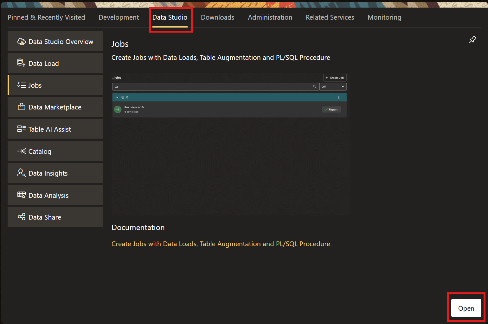
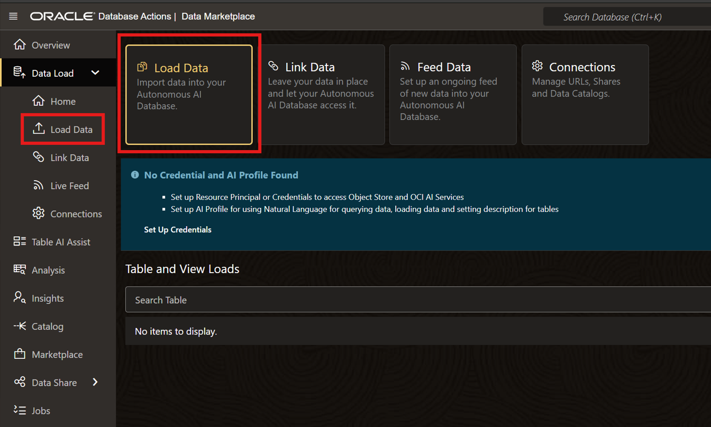
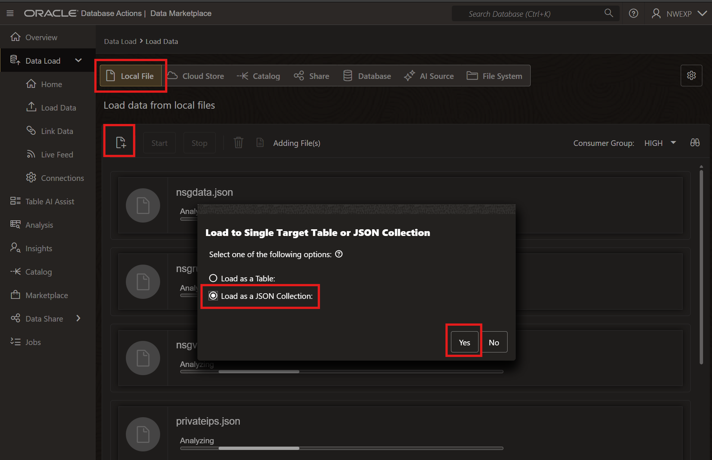
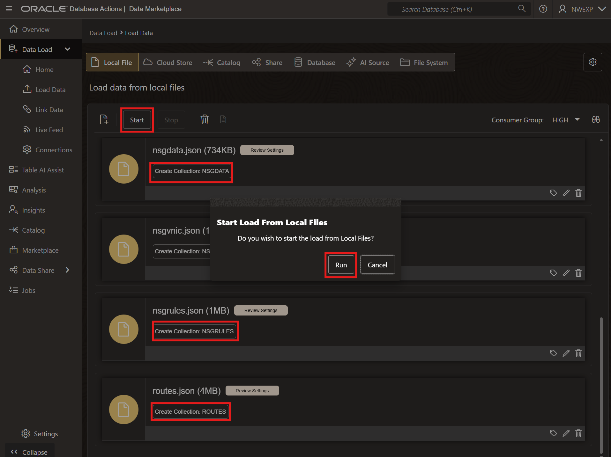
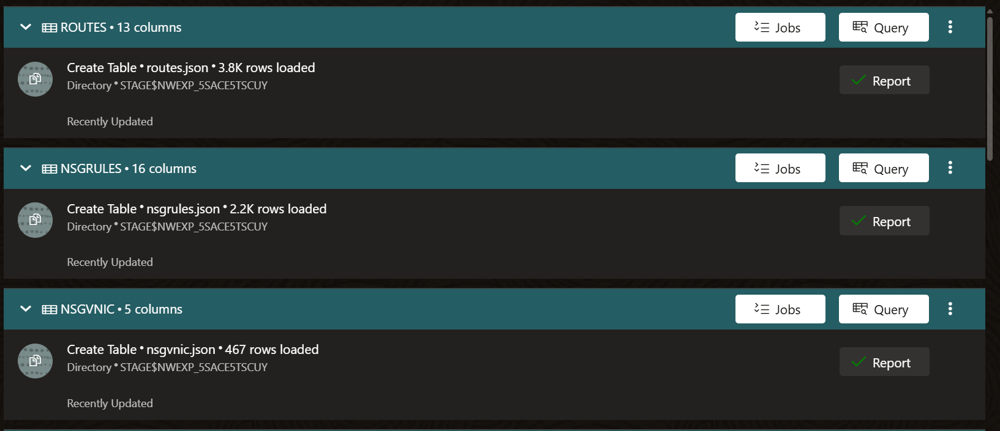
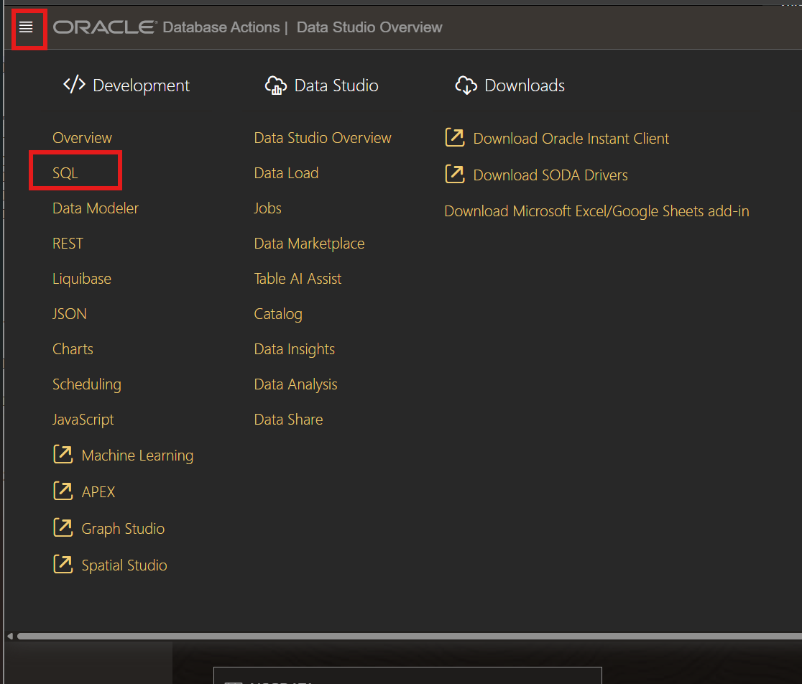
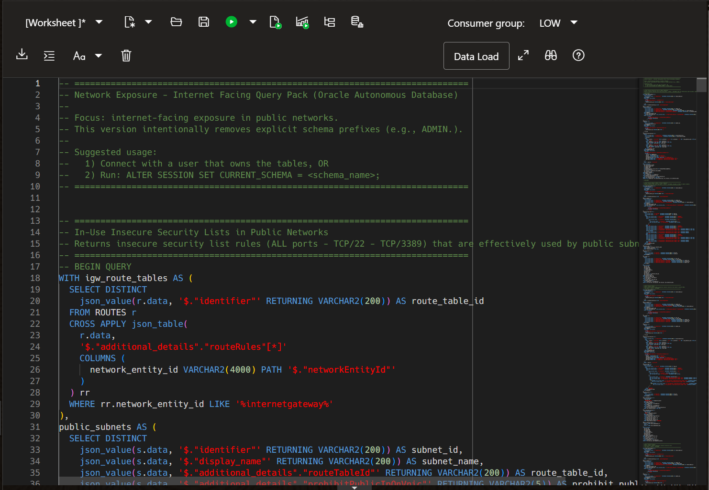
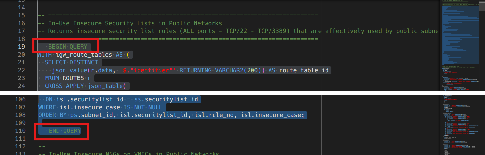
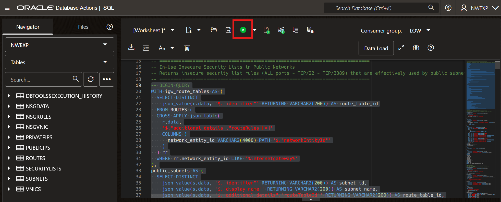
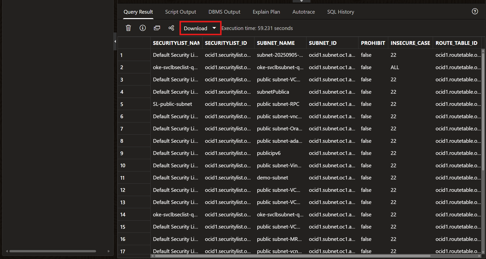

# OCI Network Exposure Analytics Toolkit

A toolkit to collect, load, and analyze Oracle Cloud Infrastructure (OCI) network exposure data, with focus on internet-facing resources, unused security rules, and overly permissive rules usage.

## Overview

This project enables security and cloud teams to identify high-risk security rules (Security Lists and NSGs) affecting workloads and infrastructure, as well as potentially risky OCI assets. It provides usage and exposure context to facilitate effective prioritization and remediation by:

- collecting network resource metadata across regions and compartments,
- loading JSONL datasets into Oracle Autonomous Database*,
- running SQL queries to correlate security rules, subnets, VNICs, routes, and public reachability context.

*The instructions are based on Oracle Autonomous AI Database using Database Actions for ease of use. You may use any Oracle Database, as long as you load the data as JSON collections and run the provided queries in your preferred tool.

The main goals are to:

- support prioritization and remediation of internet-facing risk around permissive Security List and NSG rules,
- identify and work on unused security rules,
- assess wide-open rules used for internal traffic,
- strengthen overall network security posture.

### Important Note

The available artifacts were built with focus on OCI CIS Benchmark findings (2.1 to 2.4) and Cloud Guard. They do not consider other protections that may be used in conjunction, such as:

- Zero Trust Packet Routing (ZPR),
- OCI Network Firewall,
- third-party firewalls.

If these controls exist in your environment, use this toolkit as complementary analysis. It can still improve visibility and help identify internet ingress paths that may not yet be on your radar.

## Repository Structure

- `./` -> README and supporting files.
- `/scripts` -> Python script for OCI data extraction.
- `/queries` -> SQL queries for analysis in Oracle Database.
- `/docs` -> Operational and governance documentation.

## Prerequisites

##### 1. Cloud Shell **or** a host/instance configured with OCI CLI and OCI access.
##### 2. Python 3 with OCI SDK installed (`pip3 install oci`).
##### 3. IAM policies (**[PLACEHOLDER - complete with required policies for your tenancy/group]**).
```text
allow group Auditor-Group to inspect compartments in tenancy
allow group Auditor-Group to inspect tenancies in tenancy
allow group Auditor-Group to read virtual-network-family in tenancy
allow group Auditor-Group to use network-security-groups in tenancy
allow group Auditor-Group to use cloud-shell in tenancy
```
- The `use cloud-shell` statement is only required if you plan to run the data-gathering script from Cloud Shell.
- The `use network-security-groups` statement is required for `ListNetworkSecurityGroupVnics` and `ListNetworkSecurityGroupSecurityRules`.
##### 4. Oracle Autonomous Database with a schema user prepared for Database Actions/Data Load, including permissions to create objects and execute required actions.

```sql
-- Create user
CREATE USER MY_USER IDENTIFIED BY <password>;

-- Grant permissions
GRANT CREATE SESSION TO MY_USER;
GRANT DWROLE TO MY_USER;
GRANT CREATE TABLE TO MY_USER;

-- Set quota on DATA tablespace
ALTER USER MY_USER QUOTA 50M ON DATA;

-- Enable ORDS REST for schema
BEGIN
    ORDS_ADMIN.ENABLE_SCHEMA(
        p_enabled => TRUE,
        p_schema => 'MY_USER',
        p_url_mapping_type => 'BASE_PATH',
        p_url_mapping_pattern => 'my_user',
        p_auto_rest_auth => FALSE
    );
END;
/
```

## Workflow sumary

1. Download and run the data extraction script: [scripts/retrieve_nw_data.py](scripts/retrieve_nw_data.py).
2. Import generated data files into your Oracle Database as JSON collections.
3. Execute SQL query packs:
   - [queries/01_Internet_facing_queries.sql](queries/01_Internet_facing_queries.sql)
   - [queries/02_Query_items_and_cleanup_queries.sql](queries/02_Query_items_and_cleanup_queries.sql)
   - [queries/03_Private_subnets_queries.sql](queries/03_Private_subnets_queries.sql)
4. Review, prioritize, and remediate findings.

## Workflow steps

### 1. Prepare the [prerequisites](#prerequisites)

### 2. Download the script
To the instance with OCI Cli or to the Cloud Shell session

```bash
wget https://github.com/michelrhub/nw_exposure/blob/main/scripts/retrieve_nw_data.py
```

### 3. Create a Python virtual environment and install required module

```bash
python3 -m venv python-venv
source python-venv/bin/activate
pip3 install oci
```

### 4. Run the script


Using default profile/settings:

```bash
python3 ng_get_all_turbo.py
```

**Or** specifying config file and profile:

```bash
python3 retrieve_nw_data.py --config-file ~/.oci/config --profile DEFAULT
```

**Or** run in Cloud Shell (delegation token mode):

```bash
python3 retrieve_nw_data.py -dt
```

### 5. Check the results

The script generates 9 files:

- `nsgdata.json`
- `nsgrules.json`
- `nsgvnic.json`
- `privateips.json`
- `publicips.json`
- `routes.json`
- `securitylists.json`
- `subnets.json`
- `vnics.json`

### 6. Load Data Files Into the Database

#### A. Access Database Actions in your Autonomous AI Database:
 Refer to the documentation for details on how to access Database Actions:
 - [Access Database Actions as ADMIN](https://docs.oracle.com/en/cloud/paas/autonomous-database/serverless/adbsb/connect-database-actions.html#GUID-0D93A57B-193B-43F0-BDE2-174BC3E13FCC)

 - [Access Database Actions as a schema user](https://docs.oracle.com/en/cloud/paas/autonomous-database/serverless/adbsb/connect-database-actions.html#GUID-4B404CE3-C832-4089-B37A-ADE1036C7EEA)

#### B. Open Data Studio
<p align="center">
  
</p>

#### C. Click on the **Load Data** section.
<p align="center">
  
</p>

#### D. Select all (nine) data files generated in the previous step and choose **"Load as a JSON Collection"** for each file when prompted.
<p align="center">
  
</p>

#### E. Ensure that **Create Collection** is selected for all files, then click **Start**, and **Run** when prompted.
<p align="center">
  
</p>

#### F. Verify that all files were successfully loaded.
<p align="center">
  
</p>

#### G. Finally, navigate to **SQL Web**.
<p align="center">
  
</p>

[Check the Load Data documentation for details](https://docs.oracle.com/en/cloud/paas/autonomous-database/serverless/adbsb/load-data-local-database-actions.html#GUID-25CEEF91-ACE7-47BF-AF0A-4F4964018719)

### 7. Execute SQL Queries

Open SQL Developer (or Database Actions SQL Worksheet):

#### A. Open SQL Web from Database Actions
<p align="center">
  
</p>

#### B. Load or paste the contents of the chosen SQL file.
[queries/01_Internet_facing_queries.sql](queries/01_Internet_facing_queries.sql)
[queries/02_Query_items_and_cleanup_queries.sql](queries/02_Query_items_and_cleanup_queries.sql)
[queries/03_Private_subnets_queries.sql](queries/03_Private_subnets_queries.sql)

<p align="center">
  
</p>

#### C. Identify each query start/end block.
<p align="center">
  
</p>

#### D. Select and execute the query.
<p align="center">
  
</p>

#### E. Review results in the grid, or download in your preferred format.
<p align="center">
  
</p>

## Queries Description

### Internet-facing query pack

Source file: [queries/01_Internet_facing_queries.sql](queries/01_Internet_facing_queries.sql)

- In-use insecure Security Lists in public networks.
- In-use insecure NSGs on VNICs in public networks.
- Public insecure VNICs.
- Public insecure subnets.
- Other NSG rules exposing services to ANY.
- Other Security List rules exposing services to ANY.
- VNICs exposing other services to ANY.

Objective: identify effective internet-facing exposure and support risk-based prioritization.

### Cleanup and query individual items query pack

Source file: [queries/02_Query_items_and_cleanup_queries.sql](queries/02_Query_items_and_cleanup_queries.sql)

- Unused Security Lists
- Unused NSGs
- VNIC Lookup
- IP Address Lookup

### Private subnet query pack

Source file: [queries/03_Private_subnets_queries.sql](queries/03_Private_subnets_queries.sql)

- Placeholder for queries focused on permissive rules used for internal/private traffic.

## Acknowledgments

Special thanks to the developers of the [OCI CIS Compliance Script](https://github.com/oci-landing-zones/oci-cis-landingzone-quickstart/blob/main/README.md). Parts of the detection logic, data extraction strategy, and query reasoning in this repository were inspired by that work.

## License

This project is licensed under the **Universal Permissive License v1.0 (UPL-1.0)**.

See [LICENSE](LICENSE).

## Blog

Related blog post: **[PLACEHOLDER - add final blog URL here]**
